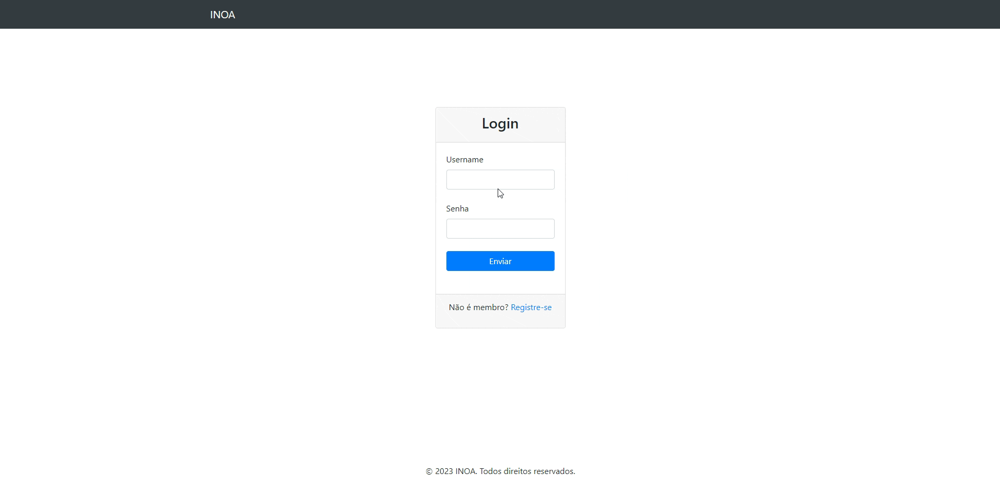
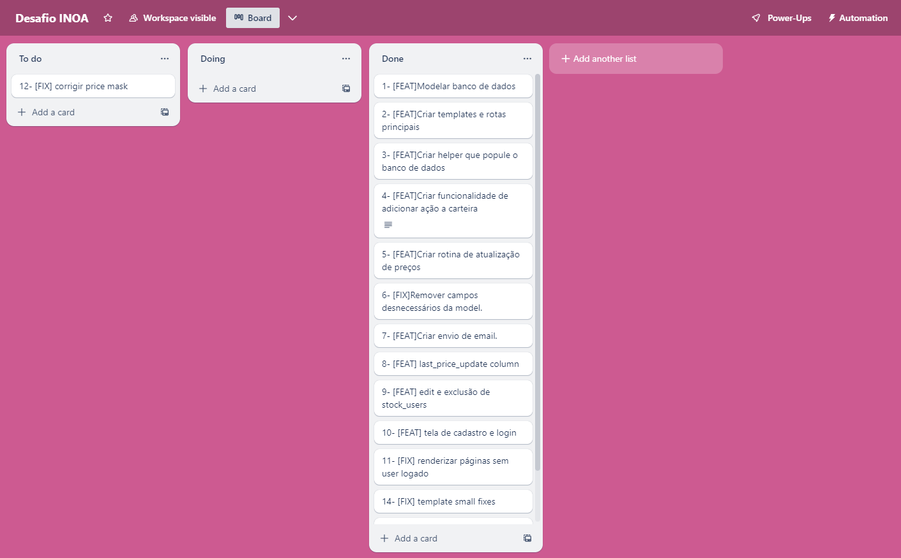
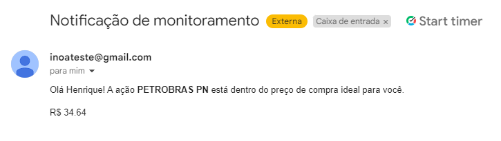

# Desafio INOA

Esse repositório é referente ao desafio proposto pela empresa INOA. O objetivo do sistema é auxiliar um investidor nas suas decisões de comprar/vender ativos. Para tal, ele deve registrar periodicamente a cotação atual de ativos da B3 e também avisar, via e-mail, caso haja oportunidade de negociação. Os seguintes requisitos funcionais são necessários:

•	Obter periodicamente as cotações de alguma fonte pública qualquer e armazená-las, em uma periodicidade configurável (em minutos)  para cada túnel, para consulta posterior
•	Expor uma interface web para permitir consultar os preços armazenados, configurar os ativos a serem monitorados e parametrizar os túneis de preço de cada ativo e periodicidade da checagem (em minutos) de cada ativo
•	Enviar e-mail para o investidor sugerindo Compra sempre que o preço de um ativo monitorado cruzar o seu limite inferior, e sugerindo Venda sempre que o preço de um ativo monitorado cruzar o seu limite superior


## Tabela de conteúdos

- [Demonstração](#demonstração)
- [Pré-requisitos](#pré-requisitos)
- [Instalação](#instalação)
- [Considerações](#considerações)

## Demonstração


## Pré-requisitos

É necessário que você tenha as seguintes ferramentas instaladas em seu computador: Git, Python, PIP, SQlite.

## Instalação

```bash
- Clone o repo:
$ git clone https://github.com/hiquebarros/desafio_inoa.git

- Crie um ambiente virtual (aqui apelidamos de venv):
$ python -m venv venv

- Ative o venv
$ venv/scripts/activate

- Instale as dependências do projeto
$ pip install -r requirements.txt

- Rode migrações
$ python manage.py migrate

- Execute o projeto (aqui estamos usando o a flag --noreload para o ambiente de desenvolvimento não iniciar a job de atualização de preços 2 vezes)
$ python manage.py runserver --noreload

- Popule o banco de dados com as ações de teste
$ python manage.py stocksDump

```

## Considerações

1- O projeto foi desenvolvido utilizando apenas a branch develop, com um merge final na master. Poderia ter sido seguido o gitflow com criação de branches, mas achei conveniente trabalhar com apenas uma branch e separar o código por tasks do kanban.


2- A lógica que usei na criação do CRON foi de acionar um job durante a inicialização de um app, e fazer toda lógica de atualização a partir deste único JOB. Não acredito que seja o melhor approach, mas tive dificuldades em encontrar uma boa biblioteca de CRON compatível com windows. A grande maioria utiliza o agendadores de tarefas nativo no Linux.

3- A senha de app do email está chumbada no código. Em um cenário real, estaria como variável de ambiente. O email foi criado apenas para a realização do teste.



4- A API de terceiros utilizada tem um recurso premium que compromete o funcionamento do teste. Caso um usuário tenha mais de uma ação em sua carteira, a requisição retornará 400, pois apenas usuários premium podem dar get em mais de uma ação ao mesmo tempo.


